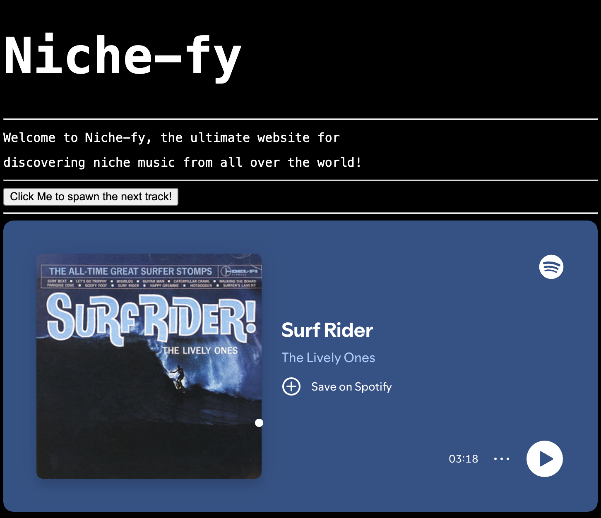

**Overview**
This is my Niche Music Website, also called: Niche-fy. This website will let you explore and discover music you might never have heard of, all while enhancing your listening experience. (This Project is actually for Hackclub #horizons, more info at https://horizons.hackclub.com/).

**What it does & How to use it**
Niche-fy is fairly simple. It spawns random niche music into the home page on the click of a button. You can then listen to the music, if you like it keep listening. If you don't click on the button again to get the next track. (Sometimes a track can spawn two times in a row, something I still have to optimize). As of 8:33 PM on the 13. of July, there are seven tracks only, but there are more to come. On the bottom of the page there is a picture of rock star Viktor Tsoi, tuning his guitar.

**How it Works**
The workings of this program are also not too advanced. Here is the flow: When the user clicks on the button under the subtitle, a function in index.js gets triggered called spawnNextTrack(). This function creates a random URL using the spotify Track IDs listed above in index.js. This source URL is then placed into the spotify track embed in index.html. Finally, this track is then displayed on the page.

**Tech Stack**
As I am a semi-beginner, I am new to the idea of a tech stack. I researched a little, and from what I could find the tech stack I am using is the "foundational Frontend Stack". (Meaning I use HTML, CSS, and JavaScript)

**Motivation**
I always have been a person who didn't listen mainstream Music. I was always more intrigued by older music from the 70s and 80s.
The reason for this project is mainly to help other people experience the wonder of listening to music that wasn't recommended by the algorithm, but rather something new, perhaps something even more exiting!

**Screenshot**
